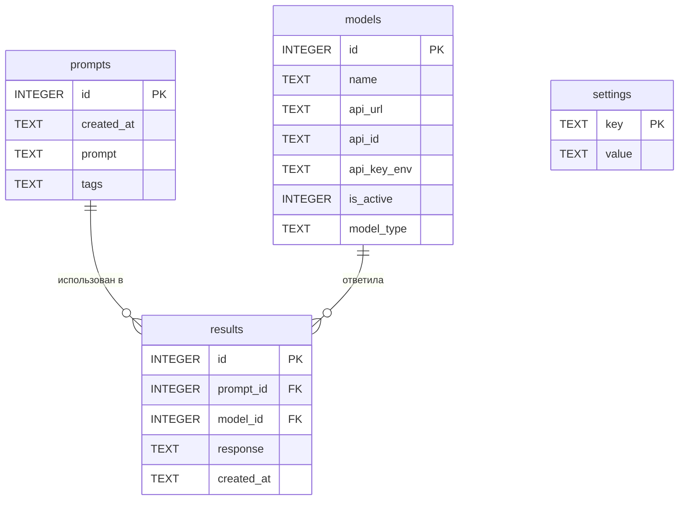

# Схема базы данных ChatList

База данных: **SQLite**, файл `chatlist.db` в каталоге приложения.

Доступ к БД — только через модуль `db.py`.

API-ключи **не хранятся** в SQLite. В таблице `models` хранится имя переменной окружения; сам ключ лежит в файле `.env`.

---

## Диаграмма связей



---

## Таблица `prompts`

Сохранённые запросы пользователя.

| Поле        | Тип     | Ограничения        | Описание                                      |
|-------------|---------|--------------------|-----------------------------------------------|
| `id`        | INTEGER | PRIMARY KEY        | Уникальный идентификатор                      |
| `created_at`| TEXT    | NOT NULL           | Дата и время создания (ISO 8601)              |
| `prompt`    | TEXT    | NOT NULL           | Текст промта                                  |
| `tags`      | TEXT    | NULL               | Теги через запятую, например: `python, api`   |

**Индексы:** `idx_prompts_created_at`, `idx_prompts_tags` (опционально, для поиска).

**Пример записи:**

| id | created_at           | prompt                         | tags        |
|----|----------------------|--------------------------------|-------------|
| 1  | 2026-09-21T10:00:00  | Объясни разницу между list и tuple | python |

---

## Таблица `models`

Подключённые нейросети через **OpenRouter**. Используются только бесплатные модели (`:free` или `openrouter/free`). Ключ API — один, в `.env`.

| Поле         | Тип     | Ограничения        | Описание                                           |
|--------------|---------|--------------------|----------------------------------------------------|
| `id`         | INTEGER | PRIMARY KEY        | Уникальный идентификатор                           |
| `name`       | TEXT    | NOT NULL, UNIQUE   | Отображаемое имя                                   |
| `api_url`    | TEXT    | NOT NULL           | `https://openrouter.ai/api/v1/chat/completions`    |
| `api_id`     | TEXT    | NOT NULL           | ID модели OpenRouter (например `qwen/qwen3.8-27b:free`) |
| `api_key_env`| TEXT    | NOT NULL           | Имя переменной в `.env` (`OPENROUTER_API_KEY`)     |
| `is_active`  | INTEGER | NOT NULL, DEFAULT 1| 1 — участвует в отправке, 0 — отключена          |
| `model_type` | TEXT    | DEFAULT 'openrouter' | Тип адаптера (всегда `openrouter`)               |

**Пример `.env`:**

```env
OPENROUTER_API_KEY=sk-or-v1-...
```

**Пример записи в `models`:**

| id | name | api_url | api_id | api_key_env | is_active | model_type |
|----|------|---------|--------|-------------|-----------|------------|
| 1 | OpenRouter Free | https://openrouter.ai/api/v1/chat/completions | openrouter/free | OPENROUTER_API_KEY | 1 | openrouter |
| 2 | Qwen3.8 27B (free) | https://openrouter.ai/api/v1/chat/completions | qwen/qwen3.8-27b:free | OPENROUTER_API_KEY | 1 | openrouter |

---

## Таблица `results`

Постоянно сохранённые ответы (только строки, отмеченные пользователем).

| Поле        | Тип     | Ограничения              | Описание                         |
|-------------|---------|--------------------------|----------------------------------|
| `id`        | INTEGER | PRIMARY KEY              | Уникальный идентификатор         |
| `prompt_id` | INTEGER | NOT NULL, FK → prompts.id| Связь с использованным промтом   |
| `model_id`  | INTEGER | NOT NULL, FK → models.id | Модель, давшая ответ             |
| `response`  | TEXT    | NOT NULL                 | Текст ответа нейросети           |
| `created_at`| TEXT    | NOT NULL                 | Дата и время сохранения          |

**Индексы:** `idx_results_prompt_id`, `idx_results_model_id`, `idx_results_created_at`.

**Пример записи:**

| id | prompt_id | model_id | response              | created_at           |
|----|-----------|----------|-----------------------|----------------------|
| 1  | 1         | 1        | list изменяемый...    | 2026-09-21T10:05:00  |

---

## Таблица `settings`

Настройки приложения в формате «ключ — значение».

| Поле   | Тип  | Ограничения | Описание              |
|--------|------|-------------|-----------------------|
| `key`  | TEXT | PRIMARY KEY | Имя настройки         |
| `value`| TEXT | NULL        | Значение настройки    |

**Примеры ключей:**

| key              | value              | Описание                          |
|------------------|--------------------|-----------------------------------|
| `request_timeout`| `30`               | Таймаут HTTP-запроса (секунды)    |
| `env_file`       | `.env`             | Путь к файлу с API-ключами        |
| `log_requests`   | `1`                | Включить логирование запросов     |
| `default_tags`   | ``                 | Теги по умолчанию для новых промтов |

---

## Временная таблица результатов (не SQLite)

Хранится **в памяти** (список объектов в `models.py`), не записывается в БД до нажатия «Сохранить».

| Поле          | Тип     | Описание                              |
|---------------|---------|---------------------------------------|
| `model_name`  | str     | Название модели (для отображения)     |
| `model_id`    | int     | ID модели из таблицы `models`         |
| `prompt_id`   | int     | ID промта (если уже сохранён)         |
| `prompt_text` | str     | Текст промта текущего запроса         |
| `response`    | str     | Текст ответа                          |
| `selected`    | bool    | Отмечен ли чекбокс пользователем      |

**Жизненный цикл:**

1. Создаётся после отправки промта в активные модели.
2. Очищается при нажатии «Сохранить» или при новом запросе.
3. Строки с `selected = True` переносятся в таблицу `results`.

---

## SQL инициализации

```sql
CREATE TABLE IF NOT EXISTS prompts (
    id         INTEGER PRIMARY KEY AUTOINCREMENT,
    created_at TEXT    NOT NULL,
    prompt     TEXT    NOT NULL,
    tags       TEXT
);

CREATE TABLE IF NOT EXISTS models (
    id          INTEGER PRIMARY KEY AUTOINCREMENT,
    name        TEXT    NOT NULL UNIQUE,
    api_url     TEXT    NOT NULL,
    api_id      TEXT    NOT NULL,
    api_key_env TEXT    NOT NULL,
    is_active   INTEGER NOT NULL DEFAULT 1,
    model_type  TEXT    NOT NULL DEFAULT 'openrouter'
);

CREATE TABLE IF NOT EXISTS results (
    id         INTEGER PRIMARY KEY AUTOINCREMENT,
    prompt_id  INTEGER NOT NULL,
    model_id   INTEGER NOT NULL,
    response   TEXT    NOT NULL,
    created_at TEXT    NOT NULL,
    FOREIGN KEY (prompt_id) REFERENCES prompts(id) ON DELETE CASCADE,
    FOREIGN KEY (model_id)  REFERENCES models(id)  ON DELETE RESTRICT
);

CREATE TABLE IF NOT EXISTS settings (
    key   TEXT PRIMARY KEY,
    value TEXT
);

CREATE INDEX IF NOT EXISTS idx_prompts_created_at ON prompts(created_at);
CREATE INDEX IF NOT EXISTS idx_models_is_active   ON models(is_active);
CREATE INDEX IF NOT EXISTS idx_results_prompt_id  ON results(prompt_id);
CREATE INDEX IF NOT EXISTS idx_results_model_id   ON results(model_id);
CREATE INDEX IF NOT EXISTS idx_results_created_at ON results(created_at);
```

---

## Ограничения целостности

- Удаление промта каскадно удаляет связанные `results` (`ON DELETE CASCADE`).
- Модель с сохранёнными результатами не удаляется без явной обработки (`ON DELETE RESTRICT` на `model_id`).
- Активные модели для отправки: `SELECT * FROM models WHERE is_active = 1`.

---

## Расположение файлов

| Файл          | Назначение                          |
|---------------|-------------------------------------|
| `chatlist.db` | База SQLite                         |
| `.env`        | Секреты (API-ключи), не в git       |
| `.env.example`| Шаблон имён переменных для `.env`   |
